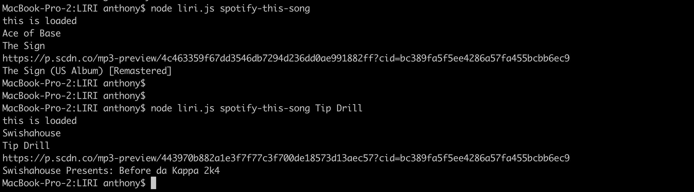
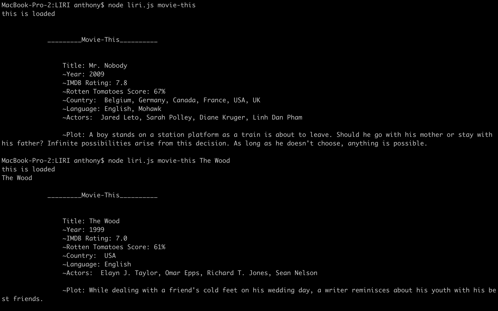

# LIRI
LIRI Bot HW assignment:
LIRI, a Language Interpretation and Recognition Interface is a command line node app that works similar to iOS's SIRI. LIRI takes in parameters given by the user and gives them back data.

Spotify this:
Description:
spotify-this-song uses node-spotify-api to search for information about a song the user inputs. It displays the artist's name, the song and ablum title, and a preview URL to a 30 second clip of the song. If no song is provided, it defaults to Ace of Base's "The Sign"

Movie-this:
Description:
movie-this uses OMDb API to search for information about a movie the user inputs. It displays the movie's title, actors, plot, release date, production location, language, and IMDb and Rotten Tomatoes ratings. If no movie is provided, it defaults to Mr. Nobody (2009, USA 2013). 

Concert This:
Description:
concert-this uses Bandsintown API to search for an artist or band's current tour dates. It displays the concert's lineup, the venue's name and location, and the date of each concert

Do What It Says:
Description:
do-what-it-says reads the file random.txt and searches the parameters written in the file.

